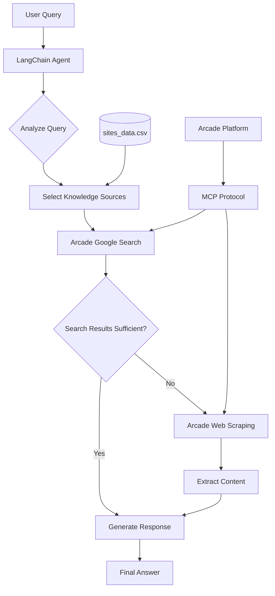

# Domain-Specific Q&A Agent with MCP: The RAG Killer Evolution

A follow-up to [QAgent](https://github.com/javiramos1/qagent) that transforms custom search and web scraping tools into managed Arcade.dev tools using the Model Context Protocol ([MCP](https://modelcontextprotocol.io/introduction)).

As we enter 2025, this project showcases how **managed tools via MCP** can further simplify the search-first approach to Q&A systems, eliminating not just RAG complexity but also the need to manage your own tool infrastructure.

## 🌟 What's New in This Version

- **🔒 Managed Tools**: Transition from custom tools to managed Arcade.dev tools
- **🛡️ Improved Security**: API keys and secrets managed by Arcade.dev platform
- **📡 MCP Integration**: Standardized tool communication via Model Context Protocol
- **⚡ Better Performance**: Optimized remote tool execution and response handling
- **🔧 Less Maintenance**: No need to manage search or scraping infrastructure

## 🤔 Understanding MCP and Arcade.dev

### Model Context Protocol (MCP)

The [Model Context Protocol](https://docs.arcade.dev/home) represents a fundamental shift in how AI models interact with external tools and APIs. At its core, MCP addresses the growing complexity and security challenges in AI tool integration, providing a standardized way for models to access and utilize external capabilities safely and efficiently.

#### Why MCP?

Traditional AI tool integration faces three major challenges that MCP solves elegantly:

**Integration Complexity**: Before MCP, each tool required its own integration code, leading to maintenance overhead and potential security vulnerabilities. MCP introduces a unified interface that reduces integration code by up to 80%, allowing developers to focus on tool functionality rather than implementation details.

**Security Management**: The traditional approach of directly connecting AI models to external APIs exposes sensitive credentials and increases attack surface. MCP's managed execution environment completely eliminates credential exposure by handling all security aspects within its isolated environment.

**Scaling Challenges**: As AI applications grow, managing rate limits and scaling individual tools becomes increasingly complex. MCP provides centralized rate limiting and intelligent queue management, ensuring reliable performance even under heavy loads.


### Arcade.dev Platform

[Arcade.dev](https://docs.arcade.dev/home) transforms MCP from a protocol specification into a production-ready platform, providing the infrastructure and tools necessary for enterprise-grade AI applications. One of its most powerful features is how it handles authentication for third-party services.

#### Authentication Delegation

A common challenge in AI applications is securely accessing services like GitHub, Slack, or Google Workspace on behalf of users. Traditional approaches require managing OAuth flows, storing refresh tokens, and handling token rotation for each service individually. This creates significant security risks and maintenance overhead.

Arcade.dev solves this through its authentication delegation system:

1. **Unified OAuth Flow**: Instead of implementing OAuth for each service, Arcade.dev provides a single authentication endpoint that handles all service connections.

2. **Token Management**: Arcade.dev securely stores and automatically refreshes access tokens, eliminating the need to handle sensitive credentials in your application.

3. **Just-in-Time Access**: When a tool needs to access a service (like creating a GitHub issue), Arcade.dev handles the authentication automatically using the stored credentials.

This means you can build features like "Create a PR on GitHub" or "Send a Slack message" without worrying about the complex authentication logic – Arcade.dev handles it all securely behind the scenes.

#### Platform Architecture

**Worker Infrastructure**: The platform operates on a globally distributed network of workers that automatically scale based on demand. Each region maintains independent worker pools with automatic failover capabilities, ensuring high availability and optimal performance for users worldwide.

**Security Framework**: Built on enterprise-grade security standards, Arcade.dev implements OAuth 2.0 and OpenID Connect for authentication, complemented by fine-grained RBAC for access control. Comprehensive audit logging and IP allowlisting provide additional security layers.

**Tool Ecosystem**: The platform maintains a curated repository of production-ready tools, each thoroughly tested and documented. Version management ensures compatibility across updates, while automated security scans protect against vulnerabilities.

**Management & Monitoring**: A sophisticated web console provides complete visibility and control over your tool ecosystem. Real-time monitoring dashboards track performance metrics, while detailed analytics help optimize resource usage and costs.


## 🔄 From Custom Tools to Arcade.dev

### Previous Implementation

Our original project implemented custom tools for:
- Web search using SerpAPI
- Web scraping using Firecrawl

This required:
- Managing multiple API keys
- Implementing error handling
- Maintaining tool code
- Monitoring tool performance

### New Arcade.dev Approach

Now we use managed tools:
- [Google Search](https://docs.arcade.dev/toolkits/search/google_search)
- [Web ScrapeURL](https://docs.arcade.dev/toolkits/development/web/web#scrapeurl)

Benefits:
- Single Arcade.dev API key
- Built-in error handling
- Zero tool maintenance
- Automatic monitoring

## 🔑 Setting Up API Access

### 1. Get Required API Keys

#### Google Search Setup:
1. Sign up at [serpapi.com](https://serpapi.com)
2. Get your API key from the dashboard
3. Add the key to your Arcade.dev secrets:
   - Go to [Arcade Console](https://console.arcade.dev)
   - Navigate to "Secrets"
   - Add "SERP_API_KEY" with your key

#### Firecrawl Setup:
1. Register at [firecrawl.dev](https://www.firecrawl.dev)
2. Obtain your API key
3. Add to Arcade.dev:
   - In Arcade Console
   - Under "Secrets"
   - Add "FIRECRAWL_API_KEY"

### 2. Get Your Arcade.dev Key

1. Sign up at [Arcade.dev](https://docs.arcade.dev/home/api-keys)
2. Create a new project
3. Generate an API key
4. Copy the key to your `.env` file:
   ```bash
   ARCADE_API_KEY=your_arcade_key_here
   ```

## 🚀 Quick Start

### Option 1: Using Make (Recommended)

```bash
# Clone the repository
git clone https://github.com/javiramos1/qagent-mcp-tools.git
cd qagent-mcp-tools

# Setup environment
make install

# Configure environment
cp .env.example .env
# Add your ARCADE_API_KEY and GOOGLE_API_KEY to .env

# Run the application
make run
```

### Option 2: Using Docker

```bash
# Clone and setup
git clone https://github.com/javiramos1/qagent-mcp-tools.git
cd qagent-mcp-tools

# Configure environment
cp .env.example .env
# Add your ARCADE_API_KEY and GOOGLE_API_KEY to .env

# Run with Docker
make docker-run
```

## 📊 RAG vs Search-First vs MCP Tools

### Traditional RAG
- ❌ Complex infrastructure
- ❌ Vector database management
- ❌ Embedding maintenance
- ❌ High operational costs

### Search-First (Previous Version)
- ✅ Simpler architecture
- ✅ No vector databases
- ❌ Multiple API keys
- ❌ Custom tool maintenance

### MCP Tools (This Version)
- ✅ Simplest architecture
- ✅ Single API key
- ✅ Zero tool maintenance
- ✅ Built-in monitoring
- ✅ Automatic updates

## 🏗️ System Architecture

### Core Components

1. **Domain-Restricted Agent**: LangChain agent that only searches approved knowledge sources
2. **Arcade Google Search**: Fast, managed search within specific documentation websites
3. **Arcade Web Scraping**: Managed web scraping for comprehensive content extraction
4. **Site Restrictions**: CSV-configured domains ensure searches stay within bounds
5. **MCP Integration**: Standardized tool communication and execution

### System Flow



### Architecture Benefits

1. **Simplified Integration**
   - Single MCP interface for all tools
   - Standardized request/response format
   - Consistent error handling

2. **Enhanced Security**
   - Secrets managed by Arcade.dev
   - Tools run in isolated environments
   - Secure API key handling

3. **Better Monitoring**
   - Built-in usage analytics
   - Performance tracking
   - Cost monitoring

4. **Automatic Scaling**
   - Tools scale independently
   - Built-in rate limiting
   - Load balancing

5. **Reduced Maintenance**
   - No tool infrastructure to manage
   - Automatic updates
   - Built-in error recovery

## 📄 License

This project is licensed under the Apache License 2.0 - see the [LICENSE](LICENSE) file for details.

## 🙏 Acknowledgments

- **LangChain** - Framework for building applications with LLMs
- **Google Gemini** - Advanced language model capabilities
- **Arcade.dev** - Managed tool platform with MCP support
- **FastAPI** - Modern web framework for APIs

---

**Note**: This project demonstrates how managed tools via MCP can simplify AI assistant development even further than the search-first approach. Feel free to adapt and extend while respecting the Apache 2.0 license terms.

